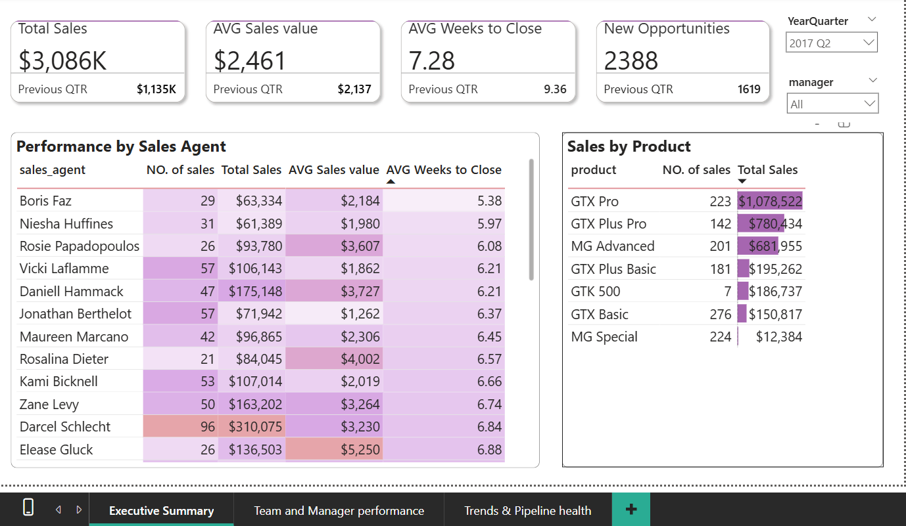
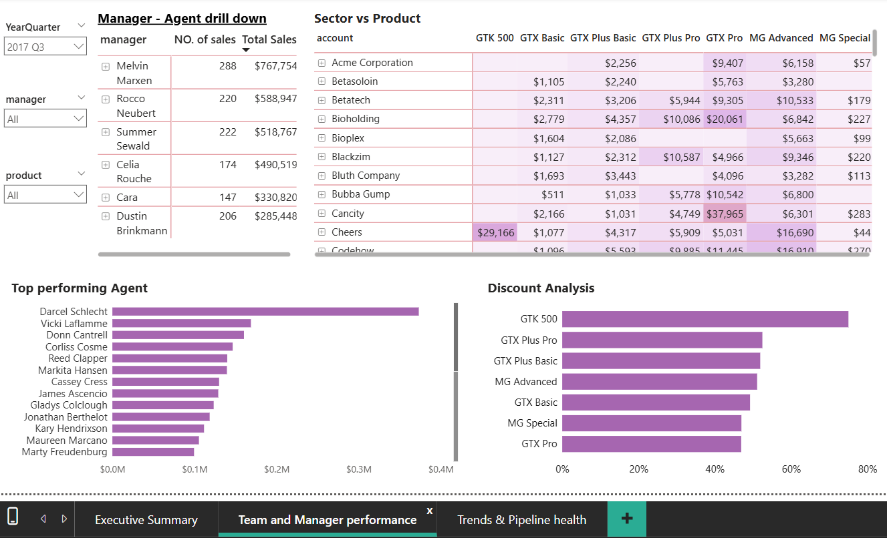

# 📊 Sales Pipeline & CRM Performance Dashboard

An interactive Power BI dashboard that turns **8,800 raw CRM sales-opportunity records** into executive, team, and pipeline-health views — built to help sales leadership track revenue, deal velocity, and rep performance every quarter.


---

## 📌 Project Overview

This project analyzes a full year of CRM sales-opportunity data to answer a question every sales organization asks: **"Where is revenue coming from, how fast are we closing deals, and who/what is driving performance?"**

I designed a **3-page Power BI report** — Executive Summary, Team & Manager Performance, and Trends & Pipeline Health — with cross-filtering by quarter, manager, and product, so managers get a fast read on revenue health and agents get a clear view of their own pipeline and close speed.

---

## 🎯 Business Problem

Sales leadership had 8,800+ opportunity records spread across regions, products, and agents but no unified way to:
- See total revenue and win rate at a glance
- Compare manager and agent performance
- Track how deal velocity (time-to-close) was trending
- Spot slowdowns in new pipeline creation before they hurt future quarters

This dashboard consolidates that data into a single, filterable, decision-ready report.

---

## 🗂️ Dataset Information

| Detail | Description |
|---|---|
| **Source** | Maven Analytics — CRM Sales Opportunities dataset |
| **Records** | 8,800 sales opportunities |
| **Time period** | Q4 2016 – Q4 2017 |
| **Sales agents** | 30 |
| **Managers** | 6 |
| **Regional offices** | 3 |
| **Client accounts** | 85 |
| **Products** | 7 |

---

## 🛠️ Tools Used

- **Power BI Desktop** — report design, visuals, cross-filtering
- **DAX** — calculated measures and KPIs
- **Power Query** — data cleaning and shaping
- **Data Modeling** — relationships between agents, managers, products, and opportunities

---

## 🧠 Skills Demonstrated

- Data modeling & relationship design
- DAX measure writing (YoY/QoQ trends, win rate, cycle time)
- KPI and executive dashboard design
- Data storytelling and business insight generation
- Cross-filtering / interactive report design
- Sales & CRM domain analysis

---

## 🔍 Methodology

1. **Data preparation** — Imported and cleaned the raw CRM export in Power Query (data types, duplicates, null handling).
2. **Data modeling** — Built relationships between opportunities, agents, managers, products, and accounts.
3. **DAX measures** — Created measures for revenue won, win rate, average deal cycle (weeks), and quarter-over-quarter trends.
4. **Report design** — Built a 3-page report:
   - **Page 1 — Executive Summary:** Top-line KPIs (revenue, win rate, avg. deal cycle, opportunity count), pipeline stage breakdown, revenue trend.
   - **Page 2 — Team & Manager Performance:** Manager and agent rankings, regional revenue comparison.
   - **Page 3 — Trends & Pipeline Health:** Deal velocity trend, new-opportunity inflow trend, product performance.
5. **Interactivity** — Added slicers/cross-filtering by quarter, manager, and product so any user can drill into their own segment.

---

## 💡 Key Insights

- **$10.0M** in closed revenue for FY2017, peaking at $3.09M in Q2 before easing to $2.98M (Q3) and $2.80M (Q4).
- Of all 8,800 opportunities: **48.16% Won**, **28.10% Lost**, **18.06% Engaging**, **5.68% Prospecting**.
- Deal velocity improved **~26%** — average weeks-to-close fell from **9.36 weeks (Q1 2017)** to **6.95 weeks (Q3)**, ticking back up slightly to **7.08 weeks (Q4)**.
- New opportunities entering the pipeline grew from **358 (Q4 2016)** to **2,770 (Q3 2017)**, then cooled sharply to **1,165 (Q4 2017)** — a signal worth flagging to leadership.
- **GTX Pro** was the top revenue product at **$3.51M across 729 deals**; the GTX product line overall drove **$7.34M (73% of total revenue)**.
- **Darcel Schlecht** was the top sales agent, closing **$1.15M across 349 deals** — more than double the next-highest performer.
- Revenue was well balanced across regions: **West ($3.57M)**, **Central ($3.35M)**, **East ($3.09M)** — no single office is carrying the business.
- **Melvin Marxen** was the top manager by team revenue at **$2.25M across 882 deals**.

---

## ✅ Recommendations

- **Investigate the Q4 pipeline slowdown** — new opportunity creation dropped ~58% from Q3 to Q4; without action this could suppress Q1 next-year revenue.
- **Study Darcel Schlecht's approach** and use it as a coaching template for underperforming agents, since their output is more than 2x the next-best rep.
- **Double down on the GTX product line**, which drives nearly three-quarters of revenue, while diversifying to reduce single-line dependency risk.
- **Replicate Q3's deal-velocity improvements** (6.95 weeks avg.) across all quarters through process or CRM workflow standardization.
- **Monitor regional balance** to keep West/Central/East growing in parallel rather than let one office fall behind.

---

## 🖼️ Dashboard Screenshots

| Executive Summary | Team & Manager Performance | Trends & Pipeline Health |
|---|---|---|
|  |  |   |
---

## 📁 Project Structure

```
sales-pipeline-crm-dashboard/
   │
   ├── README.md
   ├── LICENSE
   ├── Sales-Dashboard.pbix
   ├── Case_study_pdf.pdf
   ├── Executive_Summary.png
   ├── Team_Manager_performance.png
   └── Trends_pipeline_ health.png
```

---

## 🚀 Future Improvements

- Automate data refresh with a live/scheduled connection instead of a static import
- Add a forecasting page (predicted next-quarter revenue using trend/DAX time-intelligence)
- Add a customer/account-level drill-through page
- Publish an interactive version via Power BI Service and embed a live link
- Add row-level security so each manager only sees their own team by default

---

## 📬 Contact

Gayatri
📧 gayatri.n.0926@gmail.com

---

*Dataset: Maven Analytics — CRM Sales Opportunities (8,800 records, Oct 2016–Dec 2017). Used for educational/portfolio purposes.*
